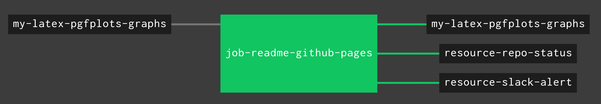

# my-latex-graphs

_A place to keep all my figures, equations
 and graphs (`.tex` files) by using LaTeX.
I use a lot of these figures in other repos._

Table of Contents,

* [MATHEMATICS - APPLIED](https://github.com/JeffDeCola/my-latex-graphs#mathematics---applied)
  * [ELECTRICAL ENGINEERING](https://github.com/JeffDeCola/my-latex-graphs#electrical-engineering)
* [MATHEMATICS - PURE](https://github.com/JeffDeCola/my-latex-graphs#mathematics---pure)
  * [CHANGES](https://github.com/JeffDeCola/my-latex-graphs#changes)
  * [FOUNDATIONS](https://github.com/JeffDeCola/my-latex-graphs#foundations)
  * [NUMBER SYSTEMS](https://github.com/JeffDeCola/my-latex-graphs#number-systems)
  * [SPACES](https://github.com/JeffDeCola/my-latex-graphs#spaces)
  * [STRUCTURES](https://github.com/JeffDeCola/my-latex-graphs#structures)
* [SCIENCE - EARTH & SPACE SCIENCE](https://github.com/JeffDeCola/my-latex-graphs#science---earth--space-science)
  * [ASTRONOMY](https://github.com/JeffDeCola/my-latex-graphs#astronomy)
* [SCIENCE - PHYSICAL SCIENCE](https://github.com/JeffDeCola/my-latex-graphs#science---physical-science)
  * [PHYSICS](https://github.com/JeffDeCola/my-latex-graphs#physics)
  
Documentation and reference,

* [LaTeX cheat sheet](https://github.com/JeffDeCola/my-cheat-sheets/tree/master/software/development/languages/latex-cheat-sheet)
* To find your LaTeX version and what packages you have installed use
  my script in
  [/find-latex-versions](https://github.com/JeffDeCola/my-latex-graphs/tree/master/find-latex-versions).

[GitHub Webpage](https://jeffdecola.github.io/my-latex-graphs/).

## MATHEMATICS - APPLIED

### ELECTRICAL ENGINEERING

* LOGIC

  * [and-gate](https://github.com/JeffDeCola/my-latex-graphs/tree/master/mathematics/applied/electrical-engineering/logic/and-gate)
  * [combinational-logic-example1](https://github.com/JeffDeCola/my-latex-graphs/tree/master/mathematics/applied/electrical-engineering/logic/combinational-logic-example1)
  * [combinational-logic-example2](https://github.com/JeffDeCola/my-latex-graphs/tree/master/mathematics/applied/electrical-engineering/logic/combinational-logic-example2)
  * [d-flip-flop](https://github.com/JeffDeCola/my-latex-graphs/tree/master/mathematics/applied/electrical-engineering/logic/d-flip-flop)
  * [priority-arbiter](https://github.com/JeffDeCola/my-latex-graphs/tree/master/mathematics/applied/electrical-engineering/logic/priority-arbiter)

## MATHEMATICS - PURE

### CHANGES

* CALCULUS

  * [diff-equation-basic](https://github.com/JeffDeCola/my-latex-graphs/tree/master/mathematics/pure/changes/calculus/diff-equation-basic) -
    _coming soon_

### FOUNDATIONS

* MATHEMATICS LOGIC

  * [example](https://github.com/JeffDeCola/my-latex-graphs/tree/master/mathematics/pure/foundations/mathematics-logic/example) -
    _coming soon_

### NUMBER SYSTEMS

* PRIME NUMBERS

  * [example](https://github.com/JeffDeCola/my-latex-graphs/tree/master/mathematics/pure/number-systems/prime-numbers/example) -
    _coming soon_

### SPACES

* GEOMETRY

  * [3d-coordinate-plane-on-a-sphere](https://github.com/JeffDeCola/my-latex-graphs/tree/master/mathematics/pure/spaces/geometry/3d-coordinate-plane-on-a-sphere)
    3D Coordinate Plane on a Sphere
  * [a-second-3d-coordinate-plane-on-a-sphere](https://github.com/JeffDeCola/my-latex-graphs/tree/master/mathematics/pure/spaces/geometry/a-second-3d-coordinate-plane-on-a-sphere)
    A second 3D Coordinate Plane on a Sphere

### STRUCTURES

* ALGEBRA

  * [coordinate-plane](https://github.com/JeffDeCola/my-latex-graphs/tree/master/mathematics/pure/structures/algebra/coordinate-plane) The coordinate plane (2D Number plane) with plot 
  * [f-of-x-equals-2x](https://github.com/JeffDeCola/my-latex-graphs/tree/master/mathematics/pure/structures/algebra/f-of-x-equals-2x)) 
  * [f-of-x-equals-minus-1-over-3-times-x-minus-3](https://github.com/JeffDeCola/my-latex-graphs/tree/master/mathematics/pure/structures/algebra/f-of-x-equals-minus-1-over-3-times-x-minus-3) 
  * [f-of-x-equals-sqrt-x](https://github.com/JeffDeCola/my-latex-graphs/tree/master/mathematics/pure/structures/algebra/f-of-x-equals-sqrt-x) 

## SCIENCE - EARTH & SPACE SCIENCE

### ASTRONOMY

* [celestial-sphere](https://github.com/JeffDeCola/my-latex-graphs/tree/master/science/earth-and-space-science/astronomy/celestial-sphere)
  Celestial Sphere

## SCIENCE - PHYSICAL SCIENCE

### PHYSICS

* [example](https://github.com/JeffDeCola/my-latex-graphs/tree/master/science/physical-science/physics) -
  _coming soon_

## UPDATE GITHUB WEBPAGE USING CONCOURSE (OPTIONAL)

For fun, I use concourse to update
[my-latex-graphs GitHub Webpage](https://jeffdecola.github.io/my-latex-graphs/)
and alert me of the changes via repo status and slack.

A pipeline file [pipeline.yml](https://github.com/JeffDeCola/my-latex-graphs/tree/master/ci/pipeline.yml)
shows the entire ci flow. Visually, it looks like,

The `jobs` and `tasks` are,

* `job-readme-github-pages` runs task
  [readme-github-pages.sh](https://github.com/JeffDeCola/my-latex-graphs/tree/master/ci/scripts/readme-github-pages.sh).

The concourse `resources types` are,

* `my-latex-graphs` uses a resource type
  [docker-image](https://hub.docker.com/r/concourse/git-resource/)
  to PULL a repo from github.
* `resource-slack-alert` uses a resource type
  [docker image](https://hub.docker.com/r/cfcommunity/slack-notification-resource)
  that will notify slack on your progress.
* `resource-repo-status` uses a resource type
  [docker image](https://hub.docker.com/r/dpb587/github-status-resource)
  that will update your git status for that particular commit.

For more information on using concourse for continuous integration,
refer to my cheat sheet on [concourse](https://github.com/JeffDeCola/my-cheat-sheets/tree/master/software/operations-tools/continuous-integration-continuous-deployment/concourse-cheat-sheet).
