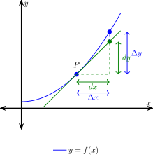

# DELTA Y VERSUS DELTA Y FUNCTION

[](https://jeffdecola.mit-license.org)
[](https://jeffdecola.com)

_Using
[LaTeX](https://github.com/JeffDeCola/my-cheat-sheets/tree/master/software/development/languages/latex-cheat-sheet/)
to graph a function._

## TEX FILE

[delta-y-vs-dy.tex](https://github.com/JeffDeCola/my-latex-renders/blob/master/mathematics/pure/changes/calculus/delta-y-vs-dy/delta-y-vs-dy.tex)

Uses LaTeX package `tikz` for creating graphs
and `pgfplots` for scientific graphs.

## CREATE

[run.sh](https://github.com/JeffDeCola/my-latex-renders/blob/master/mathematics/pure/changes/calculus/delta-y-vs-dy/run.sh)

```bash
latex delta-y-vs-dy.tex
dvisvgm -n -a -o delta-y-vs-dy delta-y-vs-dy.dvi
cp delta-y-vs-dy.svg ~/cheatsheets/my-cheat-sheets/other/stem/math/pure/changes/calculus-cheat-sheet/svgs/.
```

<p align="center">
    
</p>
