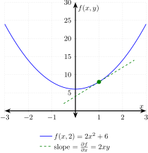

# PARTIAL DERIVATIVE WITH RESPECT TO X FUNCTION

[](https://jeffdecola.mit-license.org)
[](https://jeffdecola.com)

_Using
[LaTeX](https://github.com/JeffDeCola/my-cheat-sheets/tree/master/software/development/languages/latex-cheat-sheet/)
to graph a function._

## TEX FILE

[partial-derivative-with-respect-to-x.tex](https://github.com/JeffDeCola/my-latex-renders/blob/master/mathematics/pure/changes/calculus/partial-derivative-with-respect-to-x/partial-derivative-with-respect-to-x.tex)

Uses LaTeX package `tikz` for creating graphs
and `pgfplots` for scientific graphs.

## CREATE

[run.sh](https://github.com/JeffDeCola/my-latex-renders/blob/master/mathematics/pure/changes/calculus/partial-derivative-with-respect-to-x/run.sh)

```bash
latex partial-derivative-with-respect-to-x.tex
dvisvgm -n -a -o partial-derivative-with-respect-to-x partial-derivative-with-respect-to-x.dvi
cp partial-derivative-with-respect-to-x.svg ~/cheatsheets/my-cheat-sheets/other/stem/math/pure/changes/calculus-cheat-sheet/svgs/.
```

<p align="center">
    
</p>
