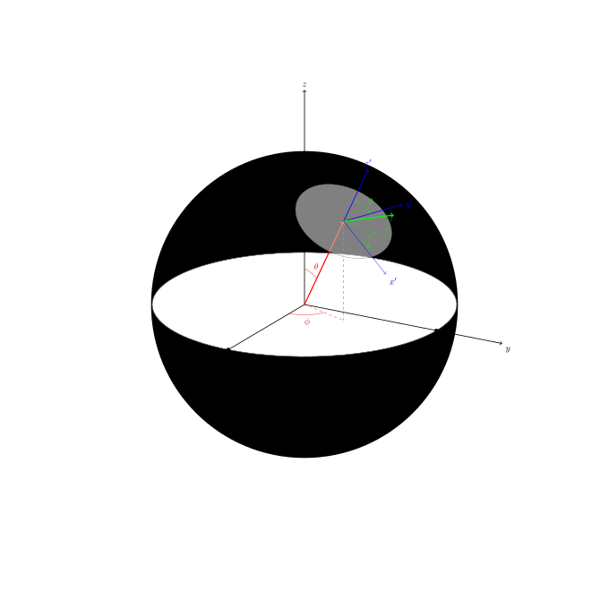

# a-second-3d-coordinate-plane-on-a-sphere

_Using
[LaTeX](https://github.com/JeffDeCola/my-cheat-sheets/tree/master/software/development/languages/latex-cheat-sheet/)
to create a second 3d coordinate plane on a sphere._

## TEX FILE

[a-second-3d-coordinate-plane-on-a-sphere.tex](a-second-3d-coordinate-plane-on-a-sphere.tex)

Uses LaTeX package `tikz` for creating graphs
and `tikz-3dplot` for 3d graphs.

## CREATE

[run.sh](run.sh)

```bash
latex a-second-3d-coordinate-plane-on-a-sphere.tex
dvisvgm -n -a -o a-second-3d-coordinate-plane-on-a-sphere a-second-3d-coordinate-plane-on-a-sphere.dvi
```

<p align="center">
    
