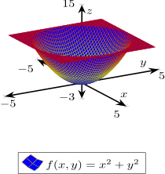

# f-of-x-and-y-equals-x-squared-plus-y-squared

[](https://jeffdecola.mit-license.org)
[](https://jeffdecola.com)

_Using
[LaTeX](https://github.com/JeffDeCola/my-cheat-sheets/tree/master/software/development/languages/latex-cheat-sheet/)
to create a point on a circle._

## TEX FILE

[f-of-x-and-y-equals-x-squared-plus-y-squared.tex](https://github.com/JeffDeCola/my-latex-renders/blob/master/mathematics/pure/spaces/geometry/f-of-x-and-y-equals-x-squared-plus-y-squared/f-of-x-and-y-equals-x-squared-plus-y-squared.tex)

Uses LaTeX package `tikz` for creating graphs.

## CREATE

[run.sh](https://github.com/JeffDeCola/my-latex-renders/blob/master/mathematics/pure/spaces/geometry/f-of-x-and-y-equals-x-squared-plus-y-squared/run.sh)

```bash
latex f-of-x-and-y-equals-x-squared-plus-y-squared.tex
dvisvgm -n -a -o f-of-x-and-y-equals-x-squared-plus-y-squared f-of-x-and-y-equals-x-squared-plus-y-squared.dvi
cp f-of-x-and-y-equals-x-squared-plus-y-squared.svg ~/cheatsheets/my-cheat-sheets/software/development/software-architectures/artificial-intelligence/artificial-intelligence-cheat-sheet/svgs/.
```

<p align="center">
    
