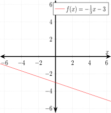

# f-of-x-equals-minus-1-over-3-times-x-minus-3

[](http://jeffdecola.mit-license.org)
[](https://jeffdecola.com)

_Using
[LaTeX](https://github.com/JeffDeCola/my-cheat-sheets/tree/master/software/development/languages/latex-cheat-sheet/)
to graph a function._

## TEX FILE

[f-of-x-equals-minus-1-over-3-times-x-minus-3.tex](https://github.com/JeffDeCola/my-latex-renders/blob/master/mathematics/pure/structures/algebra/f-of-x-equals-minus-1-over-3-times-x-minus-3/f-of-x-equals-minus-1-over-3-times-x-minus-3.tex)

Uses LaTeX package `tikz` for creating graphs
and `pgfplots` for scientific graphs.

## CREATE

[run.sh](https://github.com/JeffDeCola/my-latex-renders/blob/master/mathematics/pure/structures/algebra/f-of-x-equals-minus-1-over-3-times-x-minus-3/run.sh)

```bash
latex f-of-x-equals-minus-1-over-3-times-x-minus-3.tex
dvisvgm -n -a -o f-of-x-equals-minus-1-over-3-times-x-minus-3 f-of-x-equals-minus-1-over-3-times-x-minus-3.dvi
cp f-of-x-equals-minus-1-over-3-times-x-minus-3.svg ~/cheatsheets/my-cheat-sheets/other/mathematics/pure/structures/algebra-cheat-sheet/pgfplots-pics/.
```

<p align="center">
    
